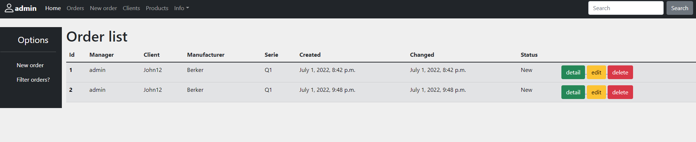
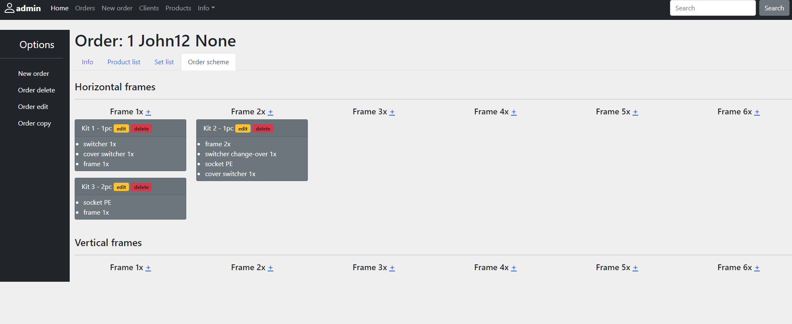
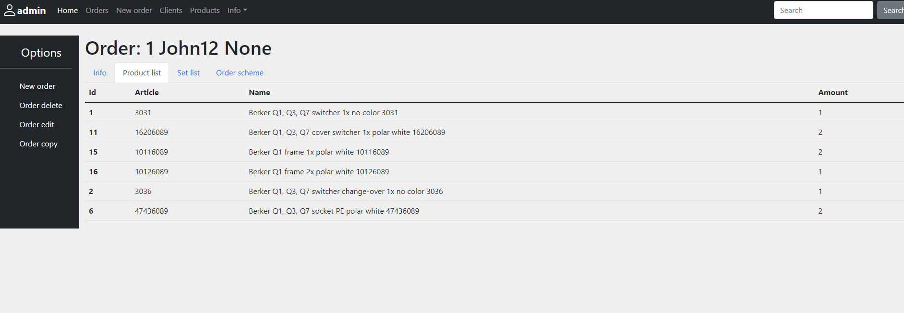
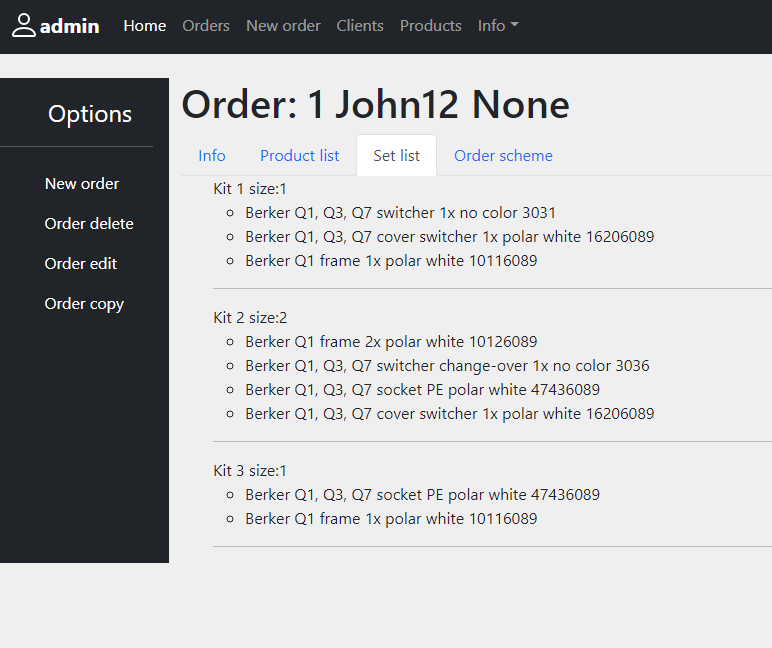

## Furniture manager

Web application which help to sell electric furniture

## Installing / Getting started

Python 3 must be already installed

```shell
git clone https://github.com/rotsen18/furniture_manager.git
cd furniture_manager
python -m venv venv
venv/scripts/activate
pip install -r requirements.txt
python manage.py runserver  # start Django project
```
## Features

* Authentication functionality for Manager
* Managing orders, users
* Simple adding furniture components
* Schematic UI which helps you create sets of elements
* Automatic rebuild order with simple series change
* Admin panel for advanced managing

## Demo




